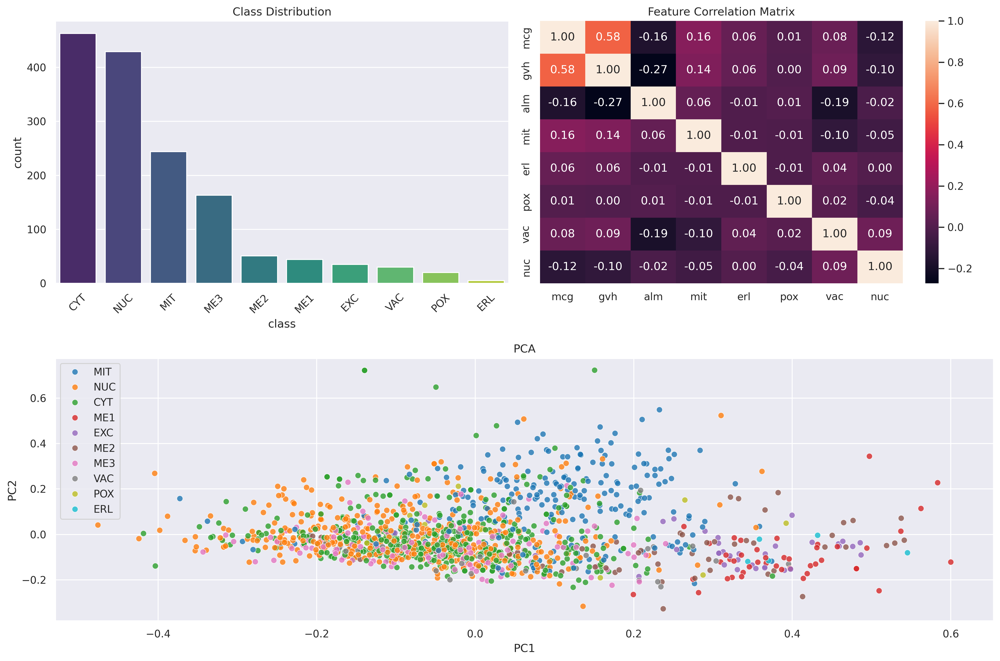

# Yeast Protein Localization -- Applied Machine Learning Project

This project uses the **Yeast Protein Localization Dataset** from the UCI Machine Learning Repository.

- Source: [UCI Yeast Dataset](https://archive.ics.uci.edu/dataset/110/yeast)
- File: `yeast.data` , `yeast.names`
- Description: 1,484 samples, 8 features, 10 classes.

To use this project:
1. Download data from the source
2. Save it in the `data/` folder at this repository.

## Dataset Overview
- **Number of instances**: 1,484
- **Number of features**: 8 numerical
- **Number of classes**: 10 localization sites
- **Missing values**: None
- **Source**: Original dataset is not included in this repository. Please download it directly from UCI.

### Data Structure

| Column Type       | Count | Description |
|-------------------|-------|-------------|
| Sequence Name     | 1     | Protein ID (SWISS-PROT accession) |
| Numerical Features| 8     | mcg, gvh, alm, mit, erl, pox, vac, nuc |
| Class Label       | 1     | Protein localization site (10 classes) |

## Features Description

| Feature | Description |
|---------|-------------|
| `mcg`  | McGeoch's method for signal sequence recognition |
| `gvh`  | von Heijne's method for signal sequence recognition |
| `alm`  | ALOM membrane spanning region score |
| `mit`  | N-terminal amino acid discriminant score (mitochondrial vs non) |
| `erl`  | Presence of “HDEL” ER retention signal (binary) |
| `pox`  | Peroxisomal targeting signal in the C-terminus |
| `vac`  | Vacuolar vs extracellular discriminant score |
| `nuc`  | Nuclear localization signal discriminant score |

## Class Distribution

| Class | Description                                | Count |
|-------|---------------------------------------------|-------|
| CYT   | Cytosolic or cytoskeletal                  | 463 |
| NUC   | Nuclear                                   | 429 |
| MIT   | Mitochondrial                            | 244 |
| ME3   | Membrane (no N-terminal signal)          | 163 |
| ME2   | Membrane (uncleaved signal)              | 51 |
| ME1   | Membrane (cleaved signal)                | 44 |
| EXC   | Extracellular                           | 37 |
| VAC   | Vacuolar                               | 30 |
| POX   | Peroxisomal                           | 20 |
| ERL   | Endoplasmic reticulum lumen          | 5 |

## Data Explore & Visualization for Better Understanding

The figure above provides an overview of the `yeast dataset` through three key exploratory analyses:
1. Class Distribution
- The dataset is highly imbalanced: `CYT` and `NUC` are the dominant classes, while classes like `POC` and `ERL` have only few samples.
- This imbalance can effect the model performance, should be taken into consideration at the model creation stage.
2. Feature Correlation
- Most features show low correlations, so they are independent.
- Only pay attention the correlation is between `mcg` and `gvh`, which is `0.58`.
3. PCA
- The PCA plot shows that classes are not clearly separable, this suggests that the data is not linearly separable. However it also shows that some classes can differ in certain directions.

